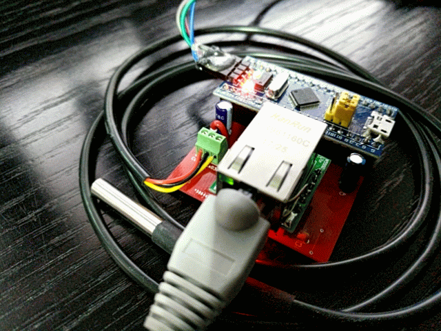
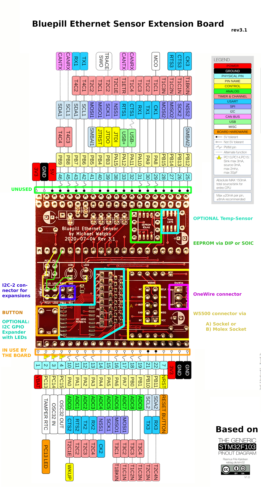
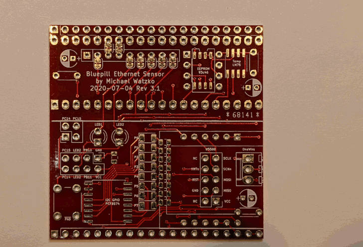

# Bluepill Ethernet Sensor Extension Board

This project is about an extension board for the Bluepill (based on stm32f103) I develop in my spare time.
I use this board to monitor the temperature at various places in my house, the CO2 concentration at my desktop as well as my energy consumption.
All values are polled through the network (UDP) by munin. You can even watch some live readings [here](https://home.watzko.de).
The board is designed to be stacked on top of another expansion PCB and provides the following functionality itself:

 - an ethernet connection via W5500
 - an OneWire connector (3.3v, GND, Data)
 - an EEPROM socket (AT93C46W via DIP or SOIC)
 - temperature sensor (LM75 SOIC)
 - a (factory reset) button
 - 2x status LEDs
    - with jumpers to disconnect them from the RTC pins (PC14 & PC15)
 - 8x LEDs via on-board GPIO-I2C-Expander PCF8574 (SOIC)
 - I2C-2 connector for further frontend expansion (3.3v, GND, SDA and SCL)

 \
(Board rev 2 connected to ethernet and with an OneWire temperature sensor)

### Pinout

On the top and bottom borders the board provides the same pin-layout as the Bluepill itself.
The top row is directly connected to the Bluepill and no pin is used by the board.
Although all pins of the bottom row are used by components on the board, they are routed through nonetheless
(keep in mind that the 2x2 jumper pins can disconnect PC14 & PC15 from the board entirely - including from the bottom pins). 

## Gallery

### Animated assembly of board rev 3.1

### CO2 expansion

todo

### GPIO LED Demo

todo

#### License

Licensed under either of <a href="LICENSE-APACHE">Apache License, Version
2.0</a> or <a href="LICENSE-MIT">MIT license</a> at your option.

 

Unless you explicitly state otherwise, any contribution intentionally submitted
for inclusion in this crate by you, as defined in the Apache-2.0 license, shall
be dual licensed as above, without any additional terms or conditions.
